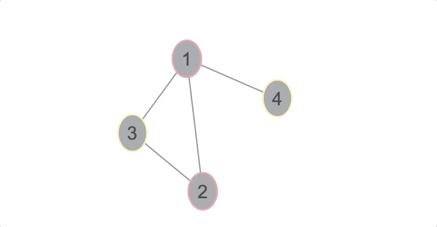

# kozvojtexMGvisjs

```julia
julia> using LightGraphs, MetaGraphs
julia> g = MetaGraph(SimpleGraph(4), 1.0)
julia> add_edge!(g, 1, 2)
julia> add_edge!(g, 1, 3)
julia> add_edge!(g, 1, 4)
julia> add_edge!(g, 2, 3)
julia> names = ["A", "B", "C", "D"]
julia> colours = ["#F990A0", "#F990A0", "#FFF0A0", "#FFF0A0"]
julia> for i=1:length(vertices(g))
           set_props!(g, i, Dict(:name => names[i], :colour => colours[i]))
       end
julia> include("mg2js.jl")
julia> create_graph_database(g, "circles")  # create_graph_database(g, "spring")
julia> run(`open -a safari visualizer.html`)
```


